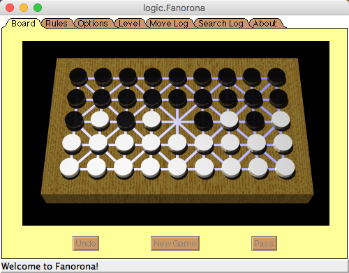
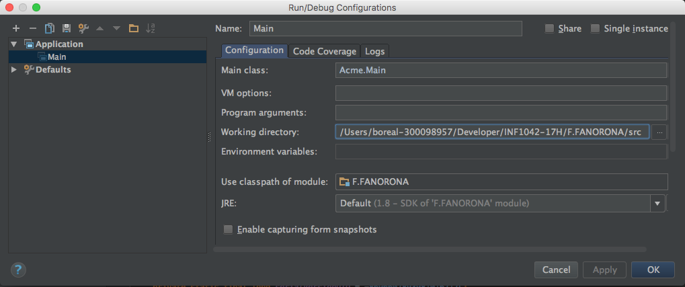

# Fanorona



## Faire tourner le programme

Assurez vous que vous pointez sur le répertoire src pour utiliser les images


## Guide du Développeur

#### Fanorona is written in Java. 
- A Tree Game Search using the [Alpha-Beta](https://chessprogramming.wikispaces.com/Alpha-Beta) Pruning search implementing: 
    * a mini-max evaluation
    * a Transposition Table
    * an Aspiration Search
    * an Internal Iterative Deepening [IID](https://chessprogramming.wikispaces.com/Internal+Iterative+Deepening)
    * an alpha-beta enhancement called Principal Variation
    * a - Memory Test Driver reducing the calculation time. MTD(f)    

#### Its UI Component is an Applet and mostly uses AWT;
- A StackLayout is a LayoutManager that arranges components in a vertical (or horizontal)  
- A [64 BitSet](docs/Fanorona%20Bits%20Explanation.xls?raw=true) allowing Data Representation and Manipulation of the board. 


```
   // Game of Fanorona
   // David Eppstein, UC Irvine, 11 Jun 1997
   //
   // Bit manipulation

   // We represent Fanorona positions using two bitboards (64-bit longs)
   // one for the pieces of each player.  The bits in the bitboard form
   // six 10-bit groups: an empty group followed by one for each row of the board.
   // Each row has an empty bit followed by a bit for each position in the row.
   // The empty bits help avoid extra range checking while finding captures.

   // The top four bits are free for other purposes; we use one
   // to determine which color pieces are on each side, and one to determine
   // whether the side on move's most recent move was a capture.
```

## Some other Tree Search Documentation


* [Strategy and board game programming](http://www.ics.uci.edu/~eppstein/180a/w99.html)  - David Eppstein's Courses at UCI - Lecture notes April 22, 1997  
* [Alpha-Beta Search](http://www.ics.uci.edu/~eppstein/180a/970422.html)  - David Eppstein's Courses at UCI  
* `Recherche arborescente` [Fixed-depth Minimax](http://www.math-info.univ-paris5.fr/~bouzy/Doc/AA2/Minimax-AlfaBeta-Bouzy.pdf) Bruno Bouzy - Universite Rene Descartes 


# Devoir

- UI and Separation du Moteur de Recherche


